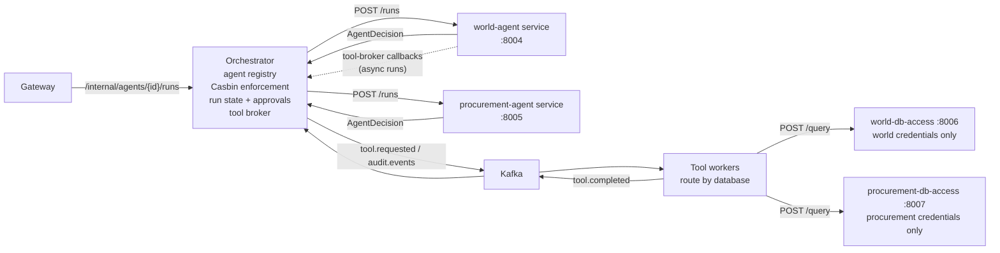

# Agent Services Design

This document describes how AI agents run as standalone services behind the
orchestrator, and the contract any future agent must implement to join the
platform. The gateway design is covered separately in `docs/gateway-design.md`.

## Goals

- One service per agent. Each agent owns its reasoning (LangGraph workflow,
  LiteLLM planning, prompts) and can be built, deployed, scaled, and versioned
  independently — including in a different language or framework.
- Configuration-only integration. Adding an agent must not require
  orchestrator code changes: run the service, add one registry entry, grant
  Casbin access.
- Central policy enforcement. Agents propose; the orchestrator disposes. All
  Casbin source/tool checks and every side effect (Kafka events, tool
  dispatch, run state, approvals) stay in the orchestrator, so a buggy or
  compromised agent cannot widen data access. This mirrors the gateway's
  edge-enforcement role one layer deeper.
- One logical trace. A run remains a single Tempo trace and a single Langfuse
  trace even though planning happens in another process.

## Topology



Each agent is a vertical slice: a credential-free planner service (world-agent,
procurement-agent) paired with a data plane that holds credentials for only its
own database (world-db-access, procurement-db-access). The orchestrator is the
shared control plane above both.

The run lifecycle:

1. The gateway forwards a trusted run request to the orchestrator.
2. The orchestrator resolves the agent in its registry, opens the Langfuse
   `agent-run` root span, and publishes `agent.requested`.
3. It calls the agent service's `POST /runs` with the run context and the
   `x-langfuse-traceparent` header.
4. The agent plans (LiteLLM planner with deterministic fallback) and returns
   an `AgentDecision` — it performs no side effects.
5. The orchestrator enforces Casbin policy on the decision, then either
   publishes `tool.requested`, records `requires_approval`, denies with an
   audit event, or — for `async` decisions — leaves the run `running` while
   the agent drives it through the tool-broker callback API.
6. For a SQL tool, the worker routes `POST /query` to the data plane that owns
   the requested database (via `DATA_PLANES`); that plane runs the final SQL
   guard against its own database. Tool completion flows back through Kafka.

## Agent registry

The orchestrator reads `AGENT_SERVICES` (comma-separated `agent-id=base-url`
pairs):

```bash
AGENT_SERVICES=world-agent=http://world-agent:8004,procurement-agent=http://procurement-agent:8005
```

At startup — and lazily on first use, so start order does not matter — the
registry fetches each agent's card from `/.well-known/agent-card` to learn its
workflow name, display name, and capabilities. Agent-service failures are
normalized like the gateway's upstream mapping: timeout → `504`,
unreachable → `502`, agent 5xx → `502`, agent 4xx passes through.
`GET /internal/agents` on the orchestrator lists the registered agents and
their discovered cards.

## Supervisor router (`assistant`)

The orchestrator itself serves one virtual agent, the supervisor router
(`ROUTER_AGENT_ID`, default `assistant`). It gives users a single place to
ask anything:

1. The message is classified by the LiteLLM planner against the live
   registry — each registered agent's card description becomes a routing
   candidate — with a deterministic keyword fallback when the LLM is not
   configured or fails.
2. General questions (anything outside the registered domains) are answered
   directly by the orchestrator's LLM with no tool or database access; the
   run completes immediately with the answer as its output.
3. Domain questions are handed to the matching agent service through the
   normal run path: same card discovery, same Casbin enforcement on the
   decision, same Kafka events and tool-broker callbacks. Before delegating,
   the router checks that the caller's policy subjects can invoke the routed
   agent (`agent:<routed-id>` `invoke`); otherwise the run is denied with an
   `agent_access_denied` audit event, so the router cannot widen access
   beyond what direct invocation would allow.

Routing is auditable (`assistant_route_selected` and
`assistant_general_answered` on `audit.events`) and traced: the classifier
and the direct answer are Langfuse generations under the run's `agent-run`
root, and a delegated run stays one logical trace across services. Because
candidates come from the registry, adding a new agent service to
`AGENT_SERVICES` extends the router without code changes. Grant
`agent:assistant` `invoke` in the Casbin policy to let a role use the router.

## Agent service contract

Any agent service must implement three endpoints. The two shipped agents get
them from `create_agent_app()` in `apps/agents/runtime.py`; a non-Python agent
implements the same shapes.

### `GET /.well-known/agent-card`

Machine-readable identity and capabilities (A2A-style):

```json
{
  "protocol": "ptvn.agent/v1",
  "id": "world-agent",
  "name": "World Analyst Agent",
  "description": "...",
  "version": "1.0.0",
  "workflow": "world",
  "capabilities": {"actions": ["approval", "report", "sql"]},
  "requirements": {"permissions": ["world-db"], "tools": ["sql", "report"]},
  "endpoints": {"run": "/runs", "health": "/health"}
}
```

### `POST /runs`

Request body (plus optional `x-langfuse-traceparent` header):

```json
{
  "request_id": "run-1",
  "tenant_id": "demo-tenant",
  "user_id": "demo-user",
  "agent_id": "world-agent",
  "message": "show the largest cities",
  "thread_id": null,
  "allowed_permissions": ["world-db"],
  "policy_subjects": ["role:world-analyst"]
}
```

Response — the decision the orchestrator will enforce and execute:

```json
{
  "protocol": "ptvn.agent/v1",
  "agent_id": "world-agent",
  "request_id": "run-1",
  "workflow": "world",
  "decision": {
    "action": "tool",
    "workflow": "world",
    "planner_action": "sql",
    "planner_source": "litellm",
    "tool": "sql",
    "tool_input": {"database": "world", "sql": "select ..."},
    "required_permission": "world-db",
    "audit_event": null,
    "reason": null
  }
}
```

`decision.action` is one of:

- `tool`: run `tool` with `tool_input`. The orchestrator checks
  `required_permission` (Casbin `datasource:* read`) and the tool (Casbin
  `tool:* execute`) before publishing `tool.requested`; a failed check denies
  the run and emits a `permission_access_denied` / `tool_access_denied` audit
  event.
- `approval`: park the run as `requires_approval` and publish the
  `audit_event` (e.g. `human_approval_required`).
- `deny`: refuse the run with `reason`.
- `async`: accept the run and drive it in the background through the
  tool-broker callback API (below). The run stays `running` until the agent
  reports its final outcome.

### `GET /health`

Liveness for compose/orchestration health checks.

## Tool-broker callback API (long-running agents)

A single decision per run is too small a contract for complex, multi-step
workflows. Agents that return `action="async"` drive the run themselves by
calling back into the orchestrator's tool broker. The security model is
unchanged: **every** callback tool request passes the same Casbin checks as
the decision path, evaluated against the policy subjects the gateway minted
when the run was created — never against anything the agent sends later. The
agent still holds no Kafka or database access.

All callback endpoints require `x-agent-id` (must match the agent that owns
the run) and, when `AGENT_CALLBACK_TOKEN` is configured on the orchestrator,
an `x-callback-token` shared secret.

### `POST /internal/runs/{run_id}/tool-calls`

Request a tool execution mid-run:

```json
{"tool": "sql", "tool_input": {"database": "world", "sql": "select ..."}, "required_permission": "world-db"}
```

The orchestrator enforces Casbin, mints `tool_call_id`
(`{run_id}:{tool}:{sequence}`), records the call, and publishes
`tool.requested`. Responds `{"run_id", "tool_call_id", "status": "requested"}`;
a failed policy check responds `403` and emits the usual
`permission_access_denied` / `tool_access_denied` audit event (the run stays
`running` — the agent chooses how to proceed).

### `GET /internal/runs/{run_id}/tool-calls/{tool_call_id}`

Poll one tool call. Returns its record (`status` is `requested`, `completed`,
or `failed`, plus `result` once settled). Tool completions consumed from
`tool.completed` settle the matching call without ending the run.

### `POST /internal/runs/{run_id}/complete`

Report the final outcome: `{"status": "completed"|"failed", "output": "...",
"result": {...}}`. This settles the run for gateway status polling, publishes
an `agent_callback_run_completed` / `agent_callback_run_failed` audit event,
and closes the Langfuse run trace.

### Agent-side helper

Python agents get `ToolBrokerClient` from `apps/agents/runtime.py`
(`request_tool`, `wait_for_tool`, `run_tool`, `complete_run`) plus the
`run_async` hook on `AgentDefinition`: return `action="async"` from `decide`
and the runtime schedules `run_async(request, broker)` in the background,
reporting completion or failure automatically. The world agent's "market
brief" flow (SQL lookup, then a report built from its rows) is the reference
implementation. Configure the callback target with `ORCHESTRATOR_CALLBACK_URL`
(defaults to `ORCH_URL`).

## Per-agent data planes

Agents never hold database credentials. Instead each agent owns a data plane: a
small service built on `apps/data_access/runtime.py` that holds credentials for
**only** its own database and enforces the last-mile SQL guard. The two shipped
planes are `world-db-access` (:8006) and `procurement-db-access` (:8007).

The SQL worker owns no credentials either. It reads `DATA_PLANES`
(`database=base-url` pairs, the same shape as `AGENT_SERVICES`) and routes each
`tool.requested` SQL event to the plane that owns `tool_input.database`:

```bash
DATA_PLANES=world=http://world-db-access:8006,procurement=http://procurement-db-access:8007
```

If no plane owns the requested database, the worker fails the run rather than
routing the query elsewhere.

### `POST /query`

Request body (plus trusted `x-tenant-id` / `x-user-id` headers):

```json
{"database": "world", "sql": "select name, population from city limit 3"}
```

Each plane:

1. Refuses any request whose `database` is not the one it serves (`404`), so a
   routing mistake cannot cross domains even before the SQL guard runs.
2. Parses the SQL with `sqlglot` and allows exactly one read-only `SELECT`
   (`400` otherwise).
3. Rejects tables outside its allowlist (`403`).
4. Sets `app.tenant_id` / `app.user_id` in the Postgres session (RLS) and wraps
   the query with a row limit.

A missing database URL returns `503`. The response is `{"rows": [...]}`.

This is the credential-isolated version of a data-access layer: the world plane
physically cannot reach the procurement database, and vice versa. It complements
the orchestrator's Casbin check — the orchestrator decides *whether* a data
source may be read; the data plane guarantees *how* it is read.

## Observability

- Tempo: standard W3C `traceparent` propagation over HTTP keeps
  gateway → orchestrator → agent → Kafka → worker in one trace. Key spans:
  `orchestrator.agent_invoke` (client side) and `agent.plan.{workflow}` /
  `agent.choose_plan_action` (agent side).
- Langfuse: the orchestrator owns the `agent-run` root span and tool spans;
  the agent service parents its `agent.llm_plan` generation to that root using
  the span context carried in `x-langfuse-traceparent`. A separate header is
  used because Langfuse spans live on a dedicated tracer provider, distinct
  from the Tempo pipeline.

## Adding a new agent (checklist)

1. Create `apps/agents/<name>/main.py` with an `AgentDefinition` (identity,
   workflow, `actions`, `fallback_action`, `decide`, and optionally
   `run_async` for long-running callback-driven workflows) and
   `app = create_agent_app(DEFINITION)` — or implement the contract above in
   any stack.
2. Add a compose service running it on its own port with a `/health` check.
3. Append `agent-id=base-url` to `AGENT_SERVICES` on the orchestrator.
4. Add Casbin rules: `agent:<agent-id>` `invoke` for the intended roles, plus
   any `datasource:*` / `tool:*` rules its decisions require.
5. If the agent reads a new database, add a data plane under
   `apps/data_access/<name>/main.py` (an `AgentDataPlane` definition holding
   only that database's URL env + table allowlist), run it as its own compose
   service, and append `database=base-url` to `DATA_PLANES` on the SQL worker.
6. If the agent needs a new non-SQL tool, add a worker consuming
   `tool.requested` for that tool; the orchestrator and gateway need no changes.

## Production notes

- The registry is static per process (env-driven) with lazy card refresh. For
  dynamic fleets, replace it with service discovery or a control-plane API;
  the `AgentRegistry` interface is the seam.
- Agent run planning is stateless per request here; the LangGraph
  checkpointer/store inside each agent is in-memory and should be made durable
  before production use.
- Agent services listen on the internal network only; nothing but the
  orchestrator should reach them, and they hold no Kafka or database
  credentials.
- Tool-broker callbacks are authenticated by `x-agent-id` plus the optional
  `AGENT_CALLBACK_TOKEN` shared secret. In production, replace the shared
  secret with per-agent credentials or mTLS so one team's agent cannot
  impersonate another's; run state (including callback tool calls) is
  in-memory and should move to a durable store.
- Data planes also listen on the internal network only; only the SQL worker
  should reach them. Each holds credentials for a single database, so database
  credentials no longer live in the shared app environment — they are scoped to
  the one plane that needs them. Give each plane a distinct least-privilege
  database role in production.
