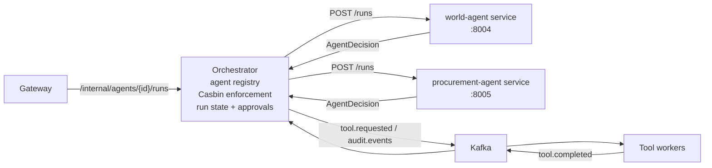

# Agent Services Design

This document describes how AI agents run as standalone services behind the
orchestrator, and the contract any future agent must implement to join the
platform. The gateway design is covered separately in `docs/gateway-design.md`.

## Goals

- One service per agent. Each agent owns its reasoning (LangGraph workflow,
  LiteLLM planning, prompts) and can be built, deployed, scaled, and versioned
  independently — including in a different language or framework.
- Configuration-only integration. Adding an agent must not require
  orchestrator code changes: run the service, add one registry entry, grant
  Casbin access.
- Central policy enforcement. Agents propose; the orchestrator disposes. All
  Casbin source/tool checks and every side effect (Kafka events, tool
  dispatch, run state, approvals) stay in the orchestrator, so a buggy or
  compromised agent cannot widen data access. This mirrors the gateway's
  edge-enforcement role one layer deeper.
- One logical trace. A run remains a single Tempo trace and a single Langfuse
  trace even though planning happens in another process.

## Topology



The run lifecycle:

1. The gateway forwards a trusted run request to the orchestrator.
2. The orchestrator resolves the agent in its registry, opens the Langfuse
   `agent-run` root span, and publishes `agent.requested`.
3. It calls the agent service's `POST /runs` with the run context and the
   `x-langfuse-traceparent` header.
4. The agent plans (LiteLLM planner with deterministic fallback) and returns
   an `AgentDecision` — it performs no side effects.
5. The orchestrator enforces Casbin policy on the decision, then either
   publishes `tool.requested`, records `requires_approval`, or denies with an
   audit event. Tool completion still flows back through Kafka.

## Agent registry

The orchestrator reads `AGENT_SERVICES` (comma-separated `agent-id=base-url`
pairs):

```bash
AGENT_SERVICES=world-agent=http://world-agent:8004,procurement-agent=http://procurement-agent:8005
```

At startup — and lazily on first use, so start order does not matter — the
registry fetches each agent's card from `/.well-known/agent-card` to learn its
workflow name, display name, and capabilities. Agent-service failures are
normalized like the gateway's upstream mapping: timeout → `504`,
unreachable → `502`, agent 5xx → `502`, agent 4xx passes through.
`GET /internal/agents` on the orchestrator lists the registered agents and
their discovered cards.

## Agent service contract

Any agent service must implement three endpoints. The two shipped agents get
them from `create_agent_app()` in `apps/agents/runtime.py`; a non-Python agent
implements the same shapes.

### `GET /.well-known/agent-card`

Machine-readable identity and capabilities (A2A-style):

```json
{
  "protocol": "ptvn.agent/v1",
  "id": "world-agent",
  "name": "World Analyst Agent",
  "description": "...",
  "version": "1.0.0",
  "workflow": "world",
  "capabilities": {"actions": ["approval", "report", "sql"]},
  "requirements": {"permissions": ["world-db"], "tools": ["sql", "report"]},
  "endpoints": {"run": "/runs", "health": "/health"}
}
```

### `POST /runs`

Request body (plus optional `x-langfuse-traceparent` header):

```json
{
  "request_id": "run-1",
  "tenant_id": "demo-tenant",
  "user_id": "demo-user",
  "agent_id": "world-agent",
  "message": "show the largest cities",
  "thread_id": null,
  "allowed_permissions": ["world-db"],
  "policy_subjects": ["role:world-analyst"]
}
```

Response — the decision the orchestrator will enforce and execute:

```json
{
  "protocol": "ptvn.agent/v1",
  "agent_id": "world-agent",
  "request_id": "run-1",
  "workflow": "world",
  "decision": {
    "action": "tool",
    "workflow": "world",
    "planner_action": "sql",
    "planner_source": "litellm",
    "tool": "sql",
    "tool_input": {"database": "world", "sql": "select ..."},
    "required_permission": "world-db",
    "audit_event": null,
    "reason": null
  }
}
```

`decision.action` is one of:

- `tool`: run `tool` with `tool_input`. The orchestrator checks
  `required_permission` (Casbin `datasource:* read`) and the tool (Casbin
  `tool:* execute`) before publishing `tool.requested`; a failed check denies
  the run and emits a `permission_access_denied` / `tool_access_denied` audit
  event.
- `approval`: park the run as `requires_approval` and publish the
  `audit_event` (e.g. `human_approval_required`).
- `deny`: refuse the run with `reason`.

### `GET /health`

Liveness for compose/orchestration health checks.

## Observability

- Tempo: standard W3C `traceparent` propagation over HTTP keeps
  gateway → orchestrator → agent → Kafka → worker in one trace. Key spans:
  `orchestrator.agent_invoke` (client side) and `agent.plan.{workflow}` /
  `agent.choose_plan_action` (agent side).
- Langfuse: the orchestrator owns the `agent-run` root span and tool spans;
  the agent service parents its `agent.llm_plan` generation to that root using
  the span context carried in `x-langfuse-traceparent`. A separate header is
  used because Langfuse spans live on a dedicated tracer provider, distinct
  from the Tempo pipeline.

## Adding a new agent (checklist)

1. Create `apps/agents/<name>/main.py` with an `AgentDefinition` (identity,
   workflow, `actions`, `fallback_action`, `decide`) and
   `app = create_agent_app(DEFINITION)` — or implement the contract above in
   any stack.
2. Add a compose service running it on its own port with a `/health` check.
3. Append `agent-id=base-url` to `AGENT_SERVICES` on the orchestrator.
4. Add Casbin rules: `agent:<agent-id>` `invoke` for the intended roles, plus
   any `datasource:*` / `tool:*` rules its decisions require.
5. If the agent needs a new tool, add a worker consuming `tool.requested` for
   that tool; the orchestrator and gateway need no changes.

## Production notes

- The registry is static per process (env-driven) with lazy card refresh. For
  dynamic fleets, replace it with service discovery or a control-plane API;
  the `AgentRegistry` interface is the seam.
- Agent run planning is stateless per request here; the LangGraph
  checkpointer/store inside each agent is in-memory and should be made durable
  before production use.
- Agent services listen on the internal network only; nothing but the
  orchestrator should reach them, and they hold no Kafka or database
  credentials.
