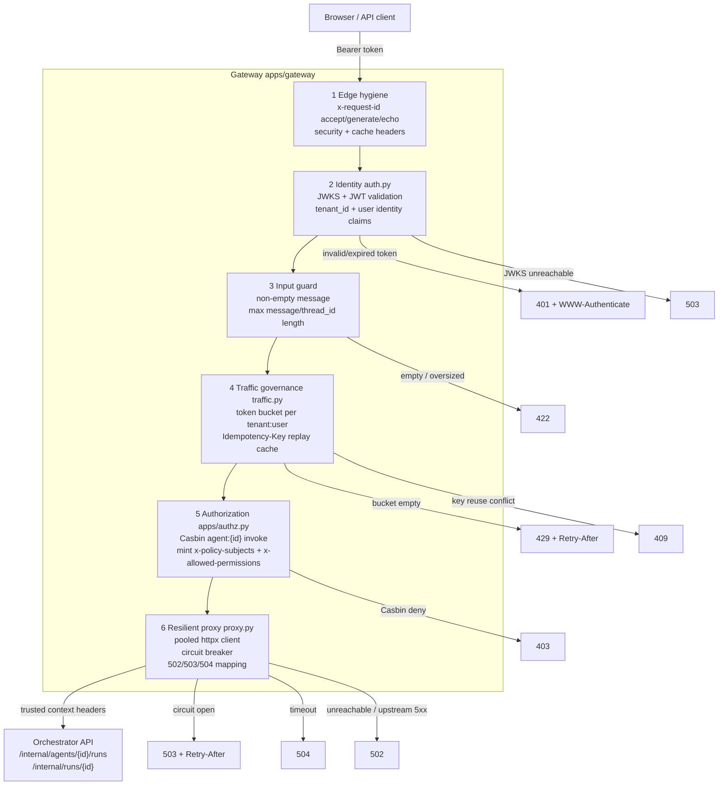

# AI Agent Gateway Design

This document describes the design of `apps/gateway`, the single public entry
point of the stack. The gateway is the edge policy-enforcement point: every
agent run, status poll, and approval passes through it, and nothing behind it
(orchestrator, workers, db-access) is exposed to clients.

## Goals

- One trusted place that turns an untrusted browser request into a trusted,
  policy-scoped internal request.
- Protect the expensive agent path (LLM planning + tool execution) from abuse,
  duplicates, and retry storms.
- Fail predictably: a broken orchestrator must surface as clean 502/503/504
  responses, never stack traces, and must not be hammered while it is down.
- Keep the existing contract intact: routes, trusted headers, response shapes,
  and the `{"detail": ...}` error shape the test console already consumes.

## Non-goals

- The gateway does not run workflows, evaluate tool/source policy for
  dispatch, or touch databases. Those checks stay in the orchestrator and
  db-access layers so a compromised or buggy gateway cannot widen data access.
- Multi-replica coordination. Traffic state is in-memory by design in this
  sample; the interfaces are shaped so a shared store can replace them.

## Layered request pipeline

Every request passes through the same ordered layers. Cheap and
high-confidence rejections happen first so expensive work is never wasted.

Ordering rationale:

1. Identity precedes everything: rate-limit keys and policy subjects are
   derived from verified claims, so nothing meaningful can happen before JWT
   validation.
2. Input guards precede rate limiting so malformed requests are rejected
   without consuming quota.
3. Rate limiting precedes authorization: throttling is per user regardless of
   target agent, and it keeps Casbin evaluation off the hot path of an abuser.
4. Idempotency runs after authorization so replayed responses are only served
   to a caller who is still allowed to invoke the agent.

## Module layout

| File | Responsibility |
| --- | --- |
| `apps/gateway/config.py` | All environment-driven settings in one frozen `GatewaySettings` dataclass. |
| `apps/gateway/auth.py` | JWKS/JWT validation dependency producing the `{user_id, tenant_id, roles}` principal. |
| `apps/gateway/traffic.py` | `TokenBucketRateLimiter` and `IdempotencyCache` (async, injectable clock). |
| `apps/gateway/proxy.py` | `OrchestratorClient` (pooled httpx client), `CircuitBreaker`, `UpstreamError` mapping. |
| `apps/gateway/main.py` | FastAPI wiring: middleware, routes, policy-context minting, metrics, health. |

## Identity layer

`current_user` validates the bearer token against the Keycloak JWKS with
issuer, audience, RS256, and configurable clock leeway
(`GATEWAY_JWT_LEEWAY_SECONDS`). Failures are explicit:

- Malformed, expired, or wrong-audience tokens: `401` with a
  `WWW-Authenticate: Bearer` header (previously these leaked as 500s).
- Unknown signing key: `401`.
- JWKS endpoint unreachable: `503` so callers can distinguish "your token is
  bad" from "the identity provider is down".
- Missing `tenant_id` or user identity claims: `401`.

## Authorization layer and trusted context

Unchanged contract, now centralized in helpers:

- Casbin check `agent:{agent_id}` / `invoke` before any forwarding; denial is
  a `403` plus an audit span attribute and a `gateway.agent_runs` metric with
  `outcome=denied`.
- The gateway mints the trusted context the rest of the stack relies on:
  `x-request-id`, `x-tenant-id`, `x-user-id`, `x-policy-subjects`,
  `x-allowed-permissions`. Internal services trust these headers, which is why
  only the gateway may be network-reachable from outside in a real deployment.

## Traffic governance

**Rate limiting.** A token bucket per `tenant_id:user_id` guards
`POST /agents/{agent_id}/runs` only — run creation is the expensive path
(LLM planning, Kafka dispatch, SQL execution). Status polling and approvals
stay unmetered so the console's polling loop is unaffected. Rejections return
`429` with a computed `Retry-After` header. Tunables:
`GATEWAY_RUN_RATE_PER_MINUTE` (default 30), `GATEWAY_RUN_RATE_BURST`
(default 10), `GATEWAY_RATE_LIMIT_ENABLED`.

**Idempotency.** Clients may send an `Idempotency-Key` header on run creation.
The cache key is `tenant:user:agent:key`; the payload fingerprint is a SHA-256
of the canonical request body.

- Same key + same payload after completion: the original response is replayed
  with `x-idempotent-replay: true` and no second run is created.
- Same key + different payload: `409`.
- Same key while the first request is still in flight: `409`.
- Upstream failure: the reservation is released so the client can retry.
- Records expire after `GATEWAY_IDEMPOTENCY_TTL_SECONDS` (default 600).

**Input guards.** Empty messages, messages over
`GATEWAY_MAX_MESSAGE_CHARS` (default 4000), and oversized `thread_id` values
are rejected with `422` before any quota or policy work happens.

## Resilient proxy

All orchestrator calls go through one lifespan-managed `httpx.AsyncClient`
(connection pooling, keep-alive) instead of a new client per request. Timeouts
are split: `GATEWAY_UPSTREAM_CONNECT_TIMEOUT_SECONDS` (default 5) and
`GATEWAY_UPSTREAM_READ_TIMEOUT_SECONDS` (default 60).

A consecutive-failure circuit breaker wraps every upstream call:

- `GATEWAY_BREAKER_FAILURE_THRESHOLD` transport failures or upstream 5xx
  responses open the circuit.
- While open, the gateway fails fast with `503` + `Retry-After` instead of
  stacking requests onto a dead orchestrator.
- After `GATEWAY_BREAKER_RESET_SECONDS` the circuit goes half-open, admits one
  probe, and closes on success or reopens on failure.

Failure mapping (no raw stack traces reach clients):

| Upstream condition | Client response |
| --- | --- |
| Circuit open | `503` + `Retry-After` |
| Connect/read timeout | `504` |
| Connection refused / transport error | `502` |
| Orchestrator 5xx | `502` |
| Orchestrator 4xx | Same status, `detail` passed through |

## Edge hygiene and correlation

Middleware on every response:

- `x-request-id`: an inbound id matching `[A-Za-z0-9][A-Za-z0-9._-]{7,127}` is
  honored (so callers can correlate across systems); anything else is replaced
  with a UUID. The id is echoed on the response, returned in the run-creation
  body, and forwarded to the orchestrator, where it becomes the `run_id`.
- `x-content-type-options: nosniff` everywhere; `cache-control: no-store` on
  API paths so tokens and run payloads are never cached.

## Health and observability

- `/healthz`: liveness only; used by the Compose healthcheck.
- `/readyz`: calls the orchestrator's `/internal/health` through the breaker,
  returning `503` until the upstream dependency is reachable.
- Existing spans (`gateway.jwt_validation`, `gateway.agent_call`,
  `gateway.run_status_response`, `gateway.approval_response`) are preserved
  with the same names and attributes, plus outcome attributes for throttled,
  replayed, and denied requests.
- New OTel metrics: `gateway.agent_runs` (counter, by `app.agent_id` and
  `app.outcome`: running/denied/throttled/replayed/invalid/rejected/
  upstream_error) and `gateway.upstream_failures` (counter, by status code).
  Both flow through the existing collector into Prometheus.

## Production hardening path

The sample keeps traffic state in process memory. The interfaces are the
contract; swap the implementation, not the routes:

- Back `TokenBucketRateLimiter` and `IdempotencyCache` with Redis (or an API
  gateway product) once more than one gateway replica runs.
- Terminate TLS ahead of the gateway and enforce network policy so only the
  gateway can reach `/internal/*` endpoints; the trusted-header model depends
  on it.
- Add response streaming (SSE/WebSocket) for long runs instead of polling.
- Add per-tenant quotas and token/cost budgets alongside the per-user rate
  limit, using the same `gateway.agent_runs` metric stream for alerting.
- Emit gateway audit events to `audit.events` on Kafka in addition to spans if
  a durable audit trail is required.
