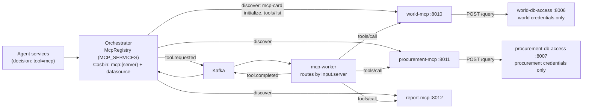

# MCP Services Design

This document describes how MCP (Model Context Protocol) tool servers run as
standalone services on the platform, and the contract any developer-built MCP
server must implement to join it. It is the MCP counterpart of
`docs/agent-services.md`: same goals, same registry pattern, same security
posture.

## Goals

- One service per MCP server. Each server owns its tools and can be built,
  deployed, scaled, and versioned independently — including in a different
  language or framework (the MCP contract is plain JSON-RPC over HTTP).
- Configuration-only integration. Adding an MCP server must not require
  orchestrator code changes: run the service and append one `MCP_SERVICES`
  entry.
- Credential-free servers. Like agents, MCP servers hold no database
  credentials: the shipped examples delegate every read to the agent data
  plane that owns the database, so the plane's SQL guard (single read-only
  SELECT, table allowlist, row cap, tenant-scoped RLS) still applies to every
  tool call.

## Topology



The three shipped examples are `world-mcp` (:8010, tools `list_top_cities`
and `country_overview`), `procurement-mcp` (:8011, tools
`list_recent_purchase_orders` and `supplier_spend_summary`), and `report-mcp`
(:8012, tool `generate_report` — a job-submission tool that reads no
databases and returns a queued report reference). All are built from the
shared runtime in `apps/mcp/runtime.py`.

## MCP registry

The orchestrator reads `MCP_SERVICES` (comma-separated `server-id=base-url`
pairs — the same shape as `AGENT_SERVICES`):

```bash
MCP_SERVICES=world-mcp=http://world-mcp:8010,procurement-mcp=http://procurement-mcp:8011,report-mcp=http://report-mcp:8012
```

At startup — and lazily on first use, so start order does not matter — the
`McpRegistry` (`apps/orchestrator/mcp_registry.py`) fetches each server's
`/.well-known/mcp-card`, then performs the MCP handshake (`initialize`) and
caches the discovered tool list (`tools/list`). Failures are normalized like
the agent registry: timeout → `504`, unreachable → `502`, server 5xx or an
invalid/JSON-RPC-error response → `502`, invalid params (e.g. unknown tool) →
`400`. `GET /internal/mcp` on the orchestrator lists the registered servers
with their cards and discovered tools. It re-runs discovery first (a no-op
once every server is known), so a server that lost the startup race is listed
with its tools instead of appearing empty.

Two callers read that tool list, both filtered per user: the gateway's
`GET /catalog` (which the chat UI's tools drawer renders), and the supervisor
router, which passes the caller's permitted tools into its general-answer
prompt so the assistant describes only what that caller can reach. Registering
a server therefore updates both with no prompt or UI changes.

`McpRegistry.call_tool(server, tool_name, arguments, headers)` invokes one
tool and returns the MCP result (`content`, `structuredContent`, `isError`).
Tool-level failures come back as `isError: true` results — the caller decides
how to treat them — while transport and protocol failures raise
`McpServiceError`.

## Agent tool decisions through MCP

MCP is the platform's only tool transport: every executable agent decision
names the `mcp` tool, and its `tool_input` addresses the target:

```json
{
  "action": "tool",
  "tool": "mcp",
  "required_permission": "world-db",
  "tool_input": {
    "server": "world-mcp",
    "name": "country_overview",
    "arguments": {"country_code": "THA"}
  }
}
```

The flow:

1. The orchestrator enforces Casbin on the decision:
   `datasource:<required_permission> read` plus the named server's
   `mcp:<server> execute` object. Per-server objects keep tool access
   separately grantable — e.g. `procurement-analyst` holds
   `mcp:procurement-mcp` but not `mcp:report-mcp`. A failed check denies the
   run with the usual audit event.
2. It publishes `tool.requested` with the MCP target in `input`.
3. The MCP worker (`apps/workers/mcp_worker.py`, consumer group
   `mcp-tool-service`) resolves `input.server` against its own `McpRegistry`
   (built from the same `MCP_SERVICES` spec) and invokes `tools/call`,
   forwarding `x-request-id` / `x-tenant-id` / `x-user-id` so RLS still
   applies at the data plane. An unregistered server fails the run explicitly
   and never guesses a target.
4. The worker publishes `tool.completed`: on success the result is
   `{"server", "tool", "output"}` (with `output` taken from
   `structuredContent`); an `isError` tool result or a transport/protocol
   failure fails the run with the error text.

Because tool-broker callbacks reuse the same `tool.requested` pipeline,
long-running `async` agents can call MCP tools mid-run through
`ToolBrokerClient.run_tool("mcp", {...}, required_permission=...)` with no
extra plumbing.

The shipped agents demonstrate the path end to end: the world agent's
lookups call `world-mcp` (`list_top_cities`, `country_overview`) and its
reports call `report-mcp` (`generate_report`); the procurement agent's
lookups and risk reviews call `procurement-mcp` (`supplier_spend_summary`).

## MCP service contract

Any MCP server must implement three endpoints. The shipped examples get
them from `create_mcp_app()` in `apps/mcp/runtime.py`; a non-Python server
implements the same shapes.

### `GET /.well-known/mcp-card`

Machine-readable identity and capabilities — the MCP analogue of the agent
card, used for platform discovery (MCP itself has no discovery document):

```json
{
  "protocol": "ptvn.mcp/v1",
  "protocol_version": "2025-06-18",
  "id": "world-mcp",
  "name": "World MCP Service",
  "description": "...",
  "version": "1.0.0",
  "capabilities": {"tools": ["list_top_cities", "country_overview"]},
  "requirements": {"permissions": ["world-db"]},
  "endpoints": {"mcp": "/mcp", "health": "/health"}
}
```

`requirements.permissions` advertises which Casbin `datasource:*` permissions
the server's tools ultimately read, so policy can be aligned before a caller
is allowed to reach the server.

### `POST /mcp`

The MCP endpoint: JSON-RPC 2.0 requests in, single JSON responses out
(Streamable HTTP, JSON mode; no batching). Supported methods:

- `initialize` → `{protocolVersion, capabilities, serverInfo, instructions}`
- `ping` → `{}`
- `tools/list` → `{"tools": [{"name", "description", "inputSchema", "_meta"}]}`
  (`_meta["ptvn/required_permission"]` carries the tool's Casbin permission)
- `tools/call` with `{"name": "...", "arguments": {...}}` →
  `{"content": [{"type": "text", "text": "..."}], "structuredContent": {...},
  "isError": false}`

Notifications (requests without an `id`, e.g. `notifications/initialized`)
are acknowledged with `202` and no body. Unknown methods return JSON-RPC
error `-32601`; an unknown tool name returns `-32602`. Tool execution
failures — bad arguments, data-plane refusals, upstream errors — are **not**
protocol errors: they come back as `isError: true` results with the detail in
`content`, per the MCP spec, so an LLM caller can see and react to them.

Tenant and user identity arrive as trusted `x-tenant-id` / `x-user-id`
headers (the same header-trust model as the data planes) and are forwarded to
the data plane, which sets them in the Postgres session for RLS. Tools that
read data refuse to run without them. The `x-request-id` header is also
passed into the tool context so job-style tools (like `generate_report`) can
mint request-scoped identifiers.

### `GET /health`

Liveness for compose/orchestration health checks.

## Writing tools (Python runtime)

A server is an `McpServerDefinition` — identity plus a tuple of `McpTool`s —
turned into a FastAPI app by `create_mcp_app()`:

```python
McpTool(
    name="list_top_cities",
    description="List the world's largest cities by population...",
    input_schema={"type": "object", "properties": {...}},
    handler=list_top_cities,          # async (arguments, McpToolContext) -> dict
    required_permission="world-db",
)
```

Handlers receive validated-by-you `arguments` and an `McpToolContext`
(`tenant_id`, `user_id`, `request_id`, shared `http` client). Raise
`McpToolError` for anything the caller should see as a tool error.
`query_data_plane()` wraps
the data-plane call: it forwards identity headers, normalizes plane failures
into `McpToolError`, and returns the rows. Because tool inputs become SQL
literals, example tools validate every input against a closed vocabulary
(enums, bounded integers, ISO-code shape) before building SQL — the data
plane's parser remains the final guard.

## Adding a new MCP server (checklist)

1. Create `apps/mcp/<name>/main.py` with an `McpServerDefinition` and
   `app = create_mcp_app(DEFINITION)` — or implement the contract above in
   any stack.
2. Add a compose service running it on its own port with a `/health` check.
3. Append `server-id=base-url` to `MCP_SERVICES` on the orchestrator **and**
   the MCP worker (they read the same variable).
4. If its tools read a database, point it at the data plane that owns that
   database (never at the database itself) and advertise the matching
   permission via `required_permission` so Casbin policy can be aligned.
5. Grant `mcp:<server-id> execute` (plus the needed `datasource:* read`) to
   the roles whose agents should reach it — each server is its own Casbin
   object, so access is grantable per server.
6. Verify discovery with `GET /internal/mcp` on the orchestrator; agents can
   then target it with `tool="mcp"` decisions.

## Production notes

- The registry is static per process (env-driven) with lazy re-discovery,
  same as the agent registry; for dynamic fleets the `McpRegistry` interface
  is the seam for service discovery or a control-plane API.
- MCP servers should listen on the internal network only. They trust
  `x-tenant-id` / `x-user-id` headers, so only trusted callers (the
  orchestrator, or a gateway that mints those headers after authentication)
  may reach them.
- This runtime implements the JSON-response subset of MCP's Streamable HTTP
  transport, which is sufficient for request/response tools. SSE streaming,
  resources, and prompts are deliberately out of scope until a consumer needs
  them.
